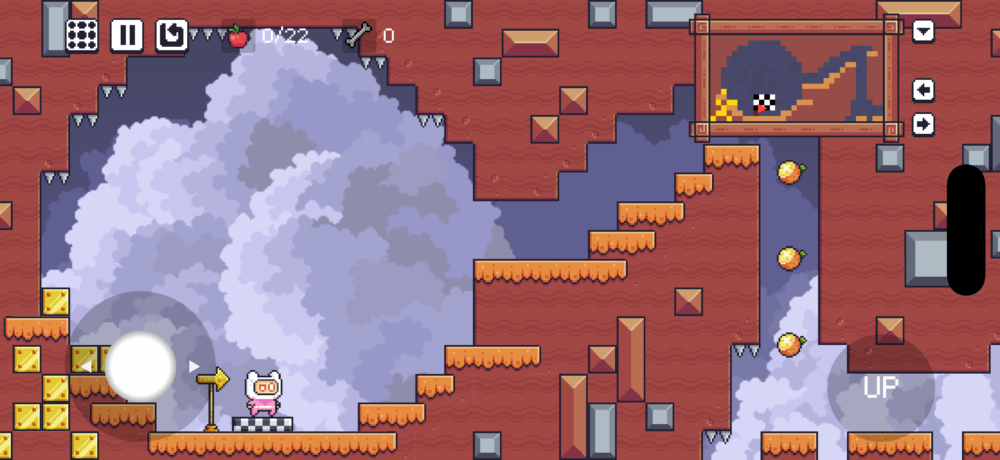
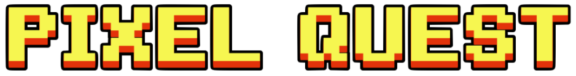
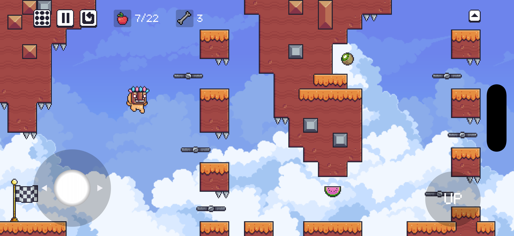
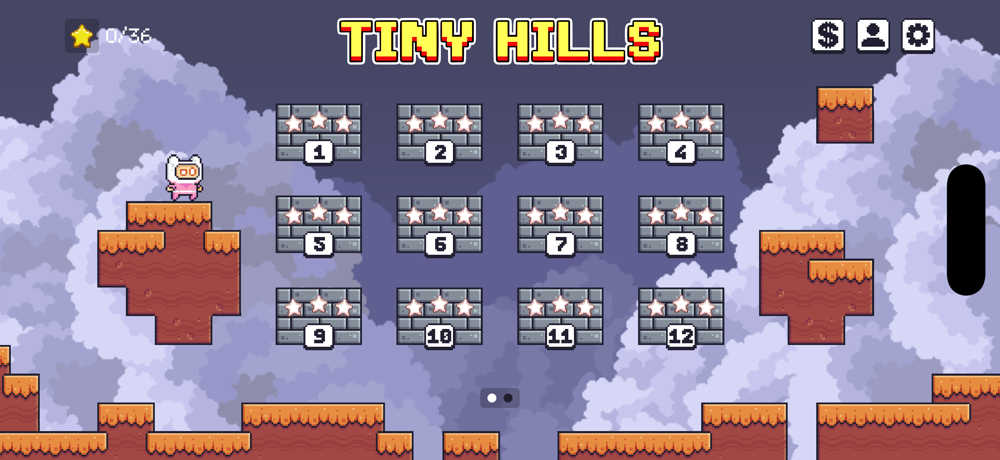
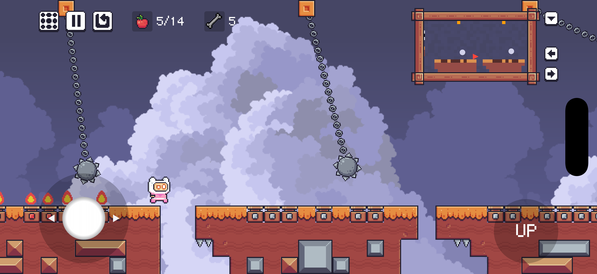
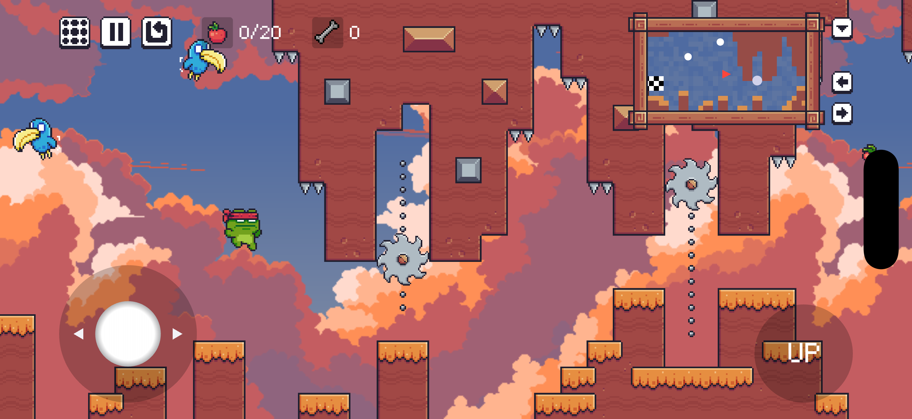
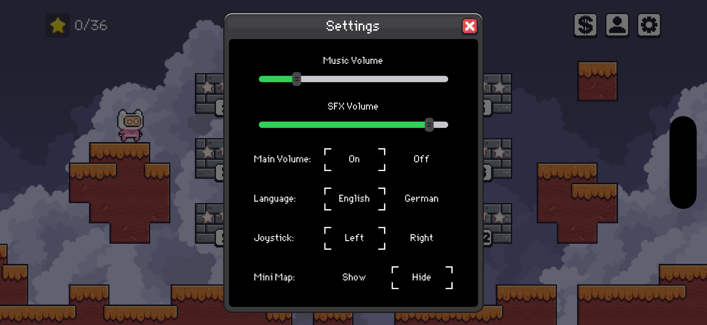
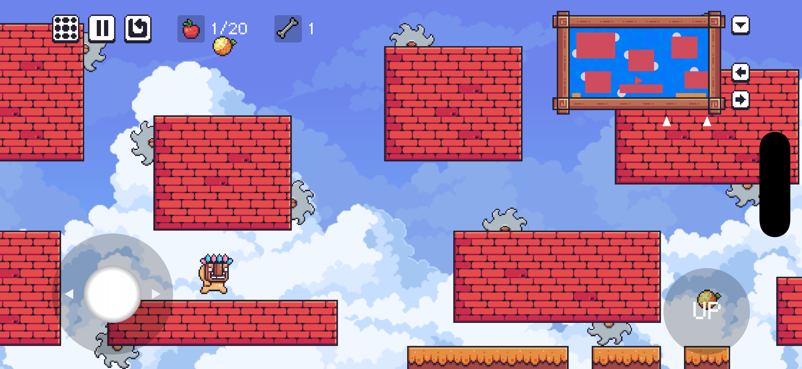
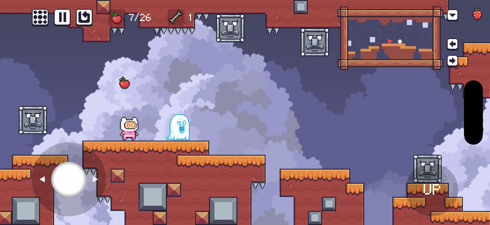

<br/>

<br/>

Pixel Quest is a retro-inspired **2D platformer** built with the Flutter **Flame Engine**. It blends classic jump’n’run gameplay with exploration across multiple worlds, packed with varied traps, enemies, and a distinctive graphic art style. Levels are built with **Tiled**.
This repository contains everything you need to run the game locally.

## 🧩 Core Features

### Gameplay & Content
- **Content-rich and scalable entity system**
  - Modular architecture designed for growth: adding new enemies/traps is straightforward.
  - Mixins provide plug-and-play features like collision participation, minimap presence, and audio emitters.
  - Already includes **~30 unique enemies and traps**, each with their own animations, behaviors, and sounds.

- **Collectibles & scoring**
  - Collect fruit collectibles per level and earn a 1–3 star rating:
    - ⭐ 1 star for completing the level
    - ⭐⭐ 2 stars for collecting at least 50% of fruits
    - ⭐⭐⭐ 3 stars for collecting 100% of fruits

- **Parallax backgrounds + inventory customization**
  - Multiple parallax scenes available.
  - Players can pick their **character** and optionally override the **level background scene** via the inventory.

---

### Collision System
- **Advanced, modular collision system**
  - Custom-built collision pipeline that resolves player interactions with **world geometry**, **traps**, and **enemies**.
  - Determines the **exact collision side** (`top`, `bottom`, `left`, `right`) to enable reliable behaviors (stomps, head hits, crushing, platforms, etc.).
  - Optimized for performance: world collisions are generated from tilemaps by **merging adjacent collision tiles into larger blocks** to reduce collision checks.
  - Highly extensible: new entities can join the system by adding the appropriate mixins/interfaces (`WorldCollision`, `EntityCollision`).

---

### Mini Map
- **Live minimap with auto-generated visuals**
  - Foreground is recorded during level load (no manual minimap assets needed for new levels).
  - Entities render in separate layers + hint arrows for obscured entities.
  - Manual minimap scrolling (hold buttons) temporarily disables auto-follow until the player moves again.

---

### Audio
- **Custom audio system + ambient loop manager**
  - Central `AudioCenter` for **SFX (via pools)**, **music**, and **ambient loops**.
  - **Source-counted ambient loops**: no “10 enemies → 10 loops” — a loop runs **once** while at least one emitter is active and stops when none remain.
  - **Smooth fade in/out** on loop start/stop to avoid hard cuts and keep transitions clean.
  - **Async-safe start/stop logic** to handle rapid state changes (enter/leave zones, multiple emitters toggling) without overlap or glitches.
  - Many SFX are **self-made**, giving the game its own character.

---

### Event System (Typed Event Bus)
- **Typed, per-game-instance event bus**
  - Lightweight way to broadcast in-game events between Flame components and other non-UI systems **without tight coupling** (no global state, no widget/state dependencies).
- **Clean API for real game usage**
  - `listen<T>()` registers strongly typed handlers per event type.
  - `listenMany(...)` groups multiple handlers into **one** `GameSubscription` → simple setup + one-line cleanup.
- **Safe + leak-free by design**
  - `GameSubscription.cancel()` removes listeners reliably (also works as a grouped subscription).
  - `emit(...)` iterates over a snapshot of listeners, so handlers can unregister themselves safely during dispatch.

---

### Reusable Flame Utilities
- **Reusable Flame utilities for UI + animation safety**
  - A set of small helpers that remove repetitive “game UI glue code” and prevent common race conditions in Flame.

- **Button toolkit (shared `_BaseBtn` mixin)**
  - Used across `TextBtn`, `SpriteBtn`, `SpriteToggleBtn` and higher-level UI like `RadioComponent`.
  - Consistent interaction rules: tap handling, press feedback (scale), cooldown against double taps, optional **hold mode** (runs every frame while held).
  - Async-friendly: `FutureOr<void>` callbacks block only when they return a `Future`. For fire-and-forget async actions, `nonBlocking(...)` keeps input responsive.

- **Cancelable effects (`CancelableAnimations`)**
  - Makes interrupting animations predictable by keeping **one active Effect per key**.
  - `registerEffect(...)` returns a Future that completes on finish *or* cancellation → safe to `await` without dangling async flows.
  - `cancelAnimations()` cancels everything and invalidates in-flight async sequences via a token bump.

---

### Settings & Persistence
- In-game settings page with separate sliders for **music volume** and **SFX volume**.
- Progress and settings are saved persistently.
- **Multiple language support**: currently **English** and **German**, easily extendable.
- **Clear separation of responsibilities**
  - **Storage Center**: handles dynamic user data (progress, settings, inventory).
  - **Static Center**: provides static game data (worlds, levels, metadata).
  - **Audio Center**: loads and manages audio assets and playback.

## ⚙️ Project Structure
A quick overview of the most important folders:

- `lib/game/` – core game runtime (router, camera, systems)
- `lib/game/level/` - level loading (Tiled), spawning, add collisions, mini map recording
- `lib/game/level/player/` - player logic (input, movement, gravity, collision checks, animations)
- `lib/game/enemies/` - a variety of enemy components
- `lib/game/traps/` - a variety of trap components
- `lib/game/hud/mini map/` - mini map view, markers, arrows, scrolling
- `lib/game/events/` – event definitions and event bus wiring
- `lib/game/utils/` – reusable Flame utilities (buttons, effects, components, helpers)
- `lib/data/` – storage, static and audio centers
- `lib/l10n/` – localization files
- `assets/` – sprites, tilemaps, audio, fonts, json data

## 🧰 Getting Started

### Prerequisites
- Flutter SDK installed
- A working Flutter environment for your target platform (iOS/Android/Desktop)
- Recommended: a physical device or emulator/simulator

### 1) Clone the repository
```bash
git clone https://github.com/TjarkGomollaDev/Pixel_Quest.git
```
```bash
cd pixel_quest
```

### 2) Install dependencies
```bash
flutter pub get
```

### 3) Run
```bash
flutter run
```

### Optional: Run on a specific device
```bash
flutter run -d <device-id>
```

## 📸 Screenshots










[](https://flame-engine.org)
